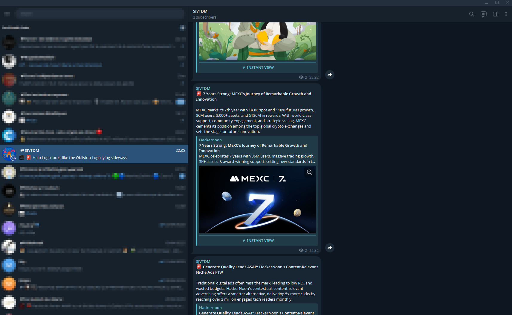

<a name="readme-top"></a>

<!-- PROJECT SHIELDS -->
[![Contributors][contributors-shield]][contributors-url]
[![Forks][forks-shield]][forks-url]
[![Stargazers][stars-shield]][stars-url]
[![Issues][issues-shield]][issues-url]
[![License][license-shield]][license-url]
[![GitHub][github-shield]][github-url]

<!-- TABLE OF CONTENTS -->
<details>
  <summary>Table of Contents</summary>
  <ol>
    <li>
      <a href="#about-the-project">About The Project</a>
      <ul>
        <li><a href="#description">Description</a></li>
        <li><a href="#planned-features">Planned Features</a></li>
        <li><a href="#built-with">Built With</a></li>
      </ul>
    </li>
    <li>
      <a href="#getting-started">Getting Started</a>
      <ul>
        <li><a href="#installation">Installation</a></li>
        <li><a href="#configuration">Configuration</a></li>
        <li><a href="#usage">Usage</a></li>
        <li><a href="#ai-code-workflows">AI Code Workflows</a></li>
        <li><a href="#tests">Tests</a></li>
      </ul>
    </li>
    <li><a href="#contributing">Contributing</a>
      <ul>
        <li><a href="#license">License</a></li>
        <li><a href="#contact">Contact</a></li>
      </ul>
    </li>
  </ol>
</details>

<!-- ABOUT THE PROJECT -->
<a name="about-the-project"></a>
# 🧠 About The Project

<p align="center">
  <a href="https://github.com/nlabrazi/dev-tools">
    
  </a>
</p>

<a name="description"></a>
### ℹ️ Description

Dev Tools is a Python CLI runner designed to automate local Git workflows across multiple repositories. It guides each step interactively, asks for confirmation before sensitive actions, and centralizes repetitive routines commonly found in multi-repo environments.

- 🔧 Interactive auto-commit on the configured integration branch, with a message preview before validation.
- 🤖 Ollama-assisted commit and Pull Request message generation, with heuristic fallback when the model is disabled or unavailable.
- 🔎 AI-assisted code reviews that explain current changes, staged changes, branch diffs, commits, or a specific file in French.
- 💬 Source comment suggestions with preview, explicit confirmation, dry-run support, and guarded file updates.
- 🔀 Pull Request creation and auto-merge between the integration branch and the base branch through `gh`.
- 📝 `CHANGELOG.md` updates generated from Conventional Commits, with semver release suggestions.
- 🔄 Safe synchronization of local base branches, with `origin/HEAD` resolution, legacy fallback, and explicit override support.
- 🛡️ Security guardrails for remote Ollama hosts to prevent unintended transmission of Git diffs or commit summaries.

---

<a name="planned-features"></a>
## 🚀 Planned Features

- 📦 Add a true non-interactive mode for CI usage and fully scripted routines.
- 🎯 Allow repository filtering by name, root directory, or execution step.
- 📊 Produce more structured final reporting for completed actions, skips, and errors.
- 🔌 Extend integrations beyond GitHub CLI for PR and release workflows.
- ⚙️ Introduce configuration profiles to chain multiple execution strategies depending on the context.

---

<a name="built-with"></a>
### 🏗️ Built With

* [![Python][Python.io]][Python-url]
* [![Git][Git.io]][Git-url]
* [![GitHub CLI][GitHubCLI.io]][GitHubCLI-url]
* [![Ollama][Ollama.io]][Ollama-url]
* [![Rich][Rich.io]][Rich-url]

<p align="right">(<a href="#readme-top">back to top</a>)</p>

<!-- GETTING STARTED -->
<a name="getting-started"></a>
# ✅ Getting Started

This project runs locally on 🐍 Python and orchestrates Git repositories available on your machine. To use the full feature set, install `git`, `gh` for Pull Request steps, and Ollama only if you want AI-assisted message generation.

<a name="installation"></a>
### 💻 Installation

```bash
# Clone the repository
git clone https://github.com/nlabrazi/dev-tools.git
cd dev-tools

# Create and activate a virtual environment
python3 -m venv .venv
source .venv/bin/activate  # On Windows use `.venv\Scripts\activate`

# Install dependencies
python3 -m pip install --upgrade pip
python3 -m pip install -r requirements.txt

# Set up environment variables
cp .env.example .env
# Update .env with your local repositories, branches and Ollama settings
```

<a name="configuration"></a>
### 🧩 Configuration

`run.py` automatically loads a `.env` file from the project root when present. Environment variables already defined in your shell take precedence.

Minimal example:

```dotenv
DEVTOOLS_ROOT_DIRS=/home/you/code/pers:/home/you/code/bricolage
DEVTOOLS_HEAD_BRANCH=staging
DEVTOOLS_REMOTE=origin
OLLAMA_HOST=http://localhost:11434
```

Useful variables:

- `DEVTOOLS_ROOT_DIRS`: root directories to scan.
- `DEVTOOLS_HEAD_BRANCH`: integration branch targeted by auto-commits and merges.
- `DEVTOOLS_BASE_BRANCH`: forces the base branch instead of using automatic resolution.
- `DEVTOOLS_REMOTE`: default Git remote.
- `ENABLE_OLLAMA`: fully enables or disables Ollama integration.
- `OLLAMA_MAX_REVIEW_DIFF_CHARS`: maximum review diff size sent to Ollama. Default: `12000`.
- `OLLAMA_MAX_REVIEW_FILE_CHARS`: maximum specific-file content size sent to Ollama. Default: `14000`.
- `OLLAMA_ALLOW_REMOTE` and `OLLAMA_ALLOW_REMOTE_CONTEXT`: explicit opt-in for remote hosts.

<a name="usage"></a>
### ▶️ Usage

```bash
# Simulate all actions without modifying repositories
python3 run.py --dry-run

# Execute the real workflow
python3 run.py --prod

# Show CLI help and resolved defaults
python3 run.py --help
```

Execution rules:

- `--dry-run` and `--prod` are mutually exclusive.
- One of them is required.
- The main menu lets you start Auto Commit, Merge, Review Code, Comment Code, Changelog, or Sync independently.
- Review Code never modifies source files.
- Comment Code always previews suggestions and asks for confirmation before applying them.
- In `--dry-run` mode, confirmed comments are simulated and no source file is written.

<a name="ai-code-workflows"></a>
### 🔎 AI Code Workflows

Both workflows first ask you to select a repository and then a code scope:

- **Current changes**: unstaged worktree changes.
- **Staged changes**: changes prepared for the next commit.
- **Compare with a branch**: diff between a base branch and `HEAD`.
- **Specific commit/ref**: changes introduced by an older commit or Git ref.
- **Specific file path**: current content and worktree diff for one repository-relative file.

#### Review Code

Review Code sends the selected context to Ollama and generates a French explanation covering the purpose, technical context, important files, behavior, points to verify, and potential risks. This workflow is read-only.

#### Comment Code

Comment Code asks Ollama for a small number of high-value source comments. Each suggestion includes a target file, a unique anchor, an insertion position, and the complete comment text.

Before writing anything, the CLI displays every suggestion and asks:

```text
Apply these comments to source files? (y/N)
```

Application is intentionally conservative:

- Only supported source files already present in the selected context can be modified.
- Sensitive files, lockfiles, binary assets, and paths outside the repository are rejected.
- Missing or ambiguous anchors are skipped rather than guessed.
- Existing identical comments are not inserted again.
- Each suggestion is reported as applied, simulated, skipped, or failed.

Ollama is local by default. Sending Git or file context to a remote Ollama host requires both `OLLAMA_ALLOW_REMOTE=1` and `OLLAMA_ALLOW_REMOTE_CONTEXT=1`.

<a name="tests"></a>
### 🧪 Tests

```bash
# Run the full rich test runner
python3 -m tests

# Run a targeted module
python3 -m tests tests.test_commit

# Stop on first failure
python3 -m tests --failfast

# Standard unittest fallback
python3 -m unittest -v
```

<p align="right">(<a href="#readme-top">back to top</a>)</p>

<!-- CONTRIBUTING -->
<a name="contributing"></a>
# 🙌 Contributing

Contributions are welcome, especially on a tool that touches sensitive Git workflows. The recommended approach stays simple and traceable.

To contribute:
1. 🍴 Fork the repository
2. 🔧 Create a dedicated branch (`git checkout -b feat/my-feature`)
3. 💬 Commit your changes (`git commit -m "feat: add my feature"`)
4. 🚀 Push your branch (`git push origin feat/my-feature`)
5. 📨 Open a Pull Request

If you change core behavior, add or update the related tests before opening the PR.

<p align="right">(<a href="#readme-top">back to top</a>)</p>

<!-- LICENSE -->
<a name="license"></a>
### 📄 License

This repository currently does not include an explicit license file.

In practice, this means the code is not formally distributed under a declared open source license. If you want to clearly allow usage, modification, and redistribution, add a `LICENSE` file and then update this section.

<p align="right">(<a href="#readme-top">back to top</a>)</p>

<!-- CONTACT -->
<a name="contact"></a>
### 📬 Contact

- 👤 [GitHub Profile][github-url]
- 📨 [Open an issue][issues-url]
- 📁 [Project Repository](https://github.com/nlabrazi/dev-tools)

<p align="right">(<a href="#readme-top">back to top</a>)</p>

<!-- MARKDOWN LINKS & IMAGES -->
[contributors-shield]: https://img.shields.io/github/contributors/nlabrazi/dev-tools.svg?style=for-the-badge
[contributors-url]: https://github.com/nlabrazi/dev-tools/graphs/contributors
[forks-shield]: https://img.shields.io/github/forks/nlabrazi/dev-tools.svg?style=for-the-badge
[forks-url]: https://github.com/nlabrazi/dev-tools/network/members
[stars-shield]: https://img.shields.io/github/stars/nlabrazi/dev-tools.svg?style=for-the-badge
[stars-url]: https://github.com/nlabrazi/dev-tools/stargazers
[issues-shield]: https://img.shields.io/github/issues/nlabrazi/dev-tools.svg?style=for-the-badge
[issues-url]: https://github.com/nlabrazi/dev-tools/issues
[license-shield]: https://img.shields.io/badge/license-not%20specified-lightgrey.svg?style=for-the-badge
[license-url]: #license
[github-shield]: https://img.shields.io/badge/GitHub-nlabrazi-181717.svg?style=for-the-badge&logo=github&logoColor=white
[github-url]: https://github.com/nlabrazi
[product-screenshot]: public/assets/images/screenshot.png
[Python.io]: https://img.shields.io/badge/python-3670A0?style=for-the-badge&logo=python&logoColor=ffdd54
[Python-url]: https://www.python.org/
[Git.io]: https://img.shields.io/badge/git-F05032?style=for-the-badge&logo=git&logoColor=white
[Git-url]: https://git-scm.com/
[GitHubCLI.io]: https://img.shields.io/badge/GitHub%20CLI-181717?style=for-the-badge&logo=github&logoColor=white
[GitHubCLI-url]: https://cli.github.com/
[Ollama.io]: https://img.shields.io/badge/-Ollama-000000?style=for-the-badge&logo=ollama&logoColor=white
[Ollama-url]: https://ollama.com/
[Rich.io]: https://img.shields.io/badge/Rich-FAA61A?style=for-the-badge&logo=rich
[Rich-url]: https://github.com/Textualize/rich
